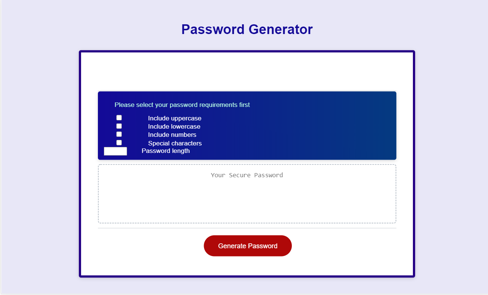
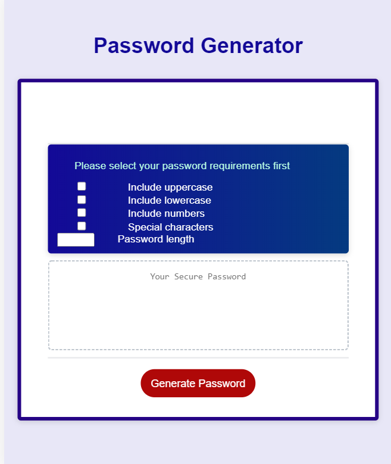
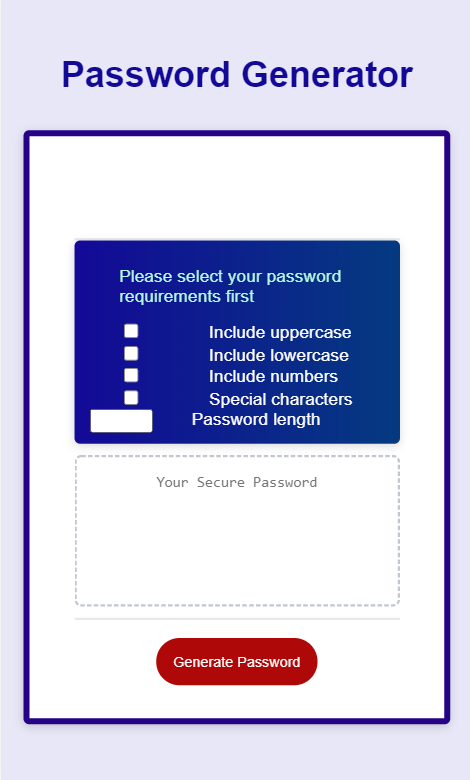

# Password-Generator

## Purpose

An app to generate password

## Description

application that an employee can use to generate a random password based on criteria they’ve selected(Lowercase,Uppercase,Numbers and Special characters) and it helps users create stronger passwords that provide greater security for a given type of access.

## Built With

- HTML
- CSS
- JAVASCRIPT

## Website

https://solomonmeresa.github.io/Password-generator/

## Visuals

Fully - responsive

## Contribution

Made by solomon

### ©️2020 Password-generator
